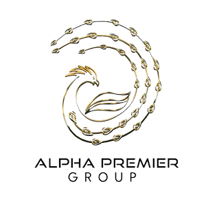
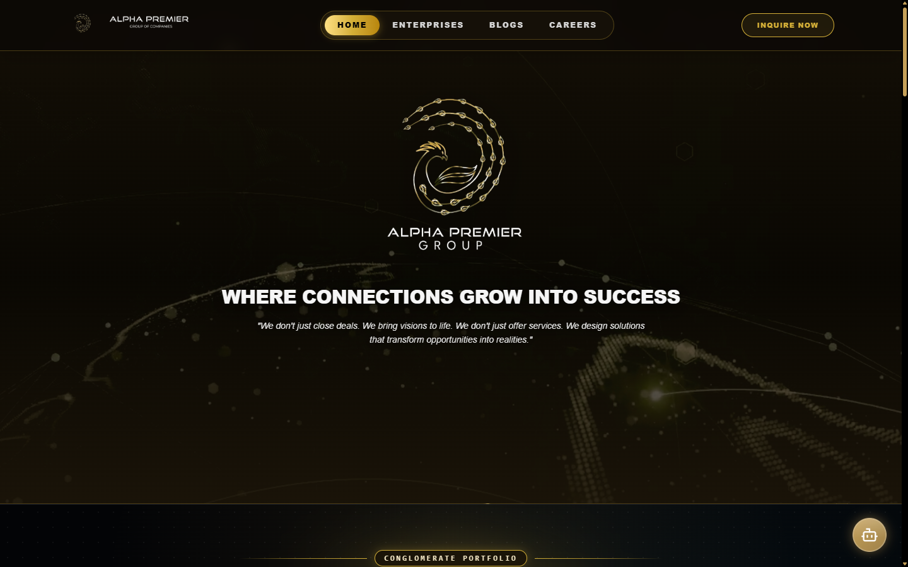
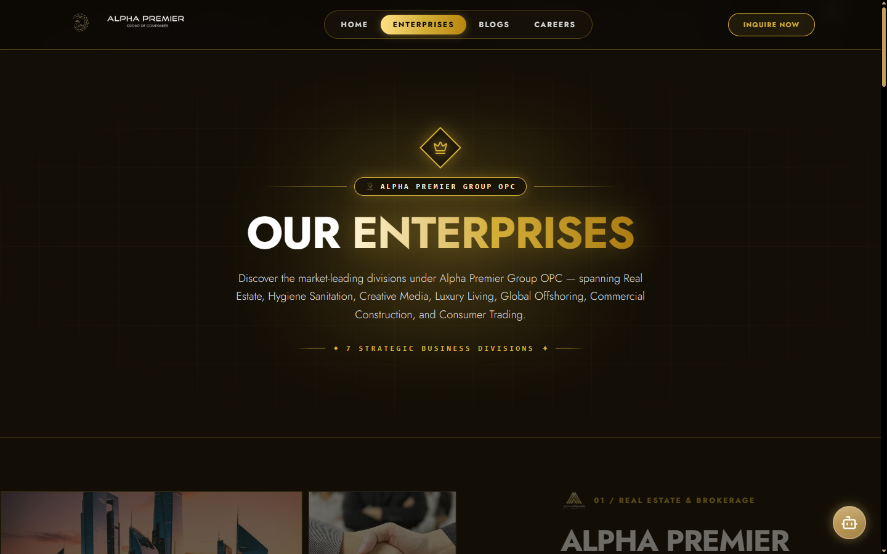
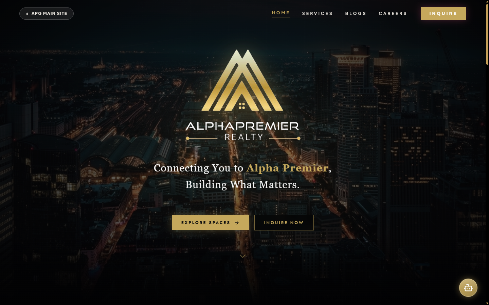
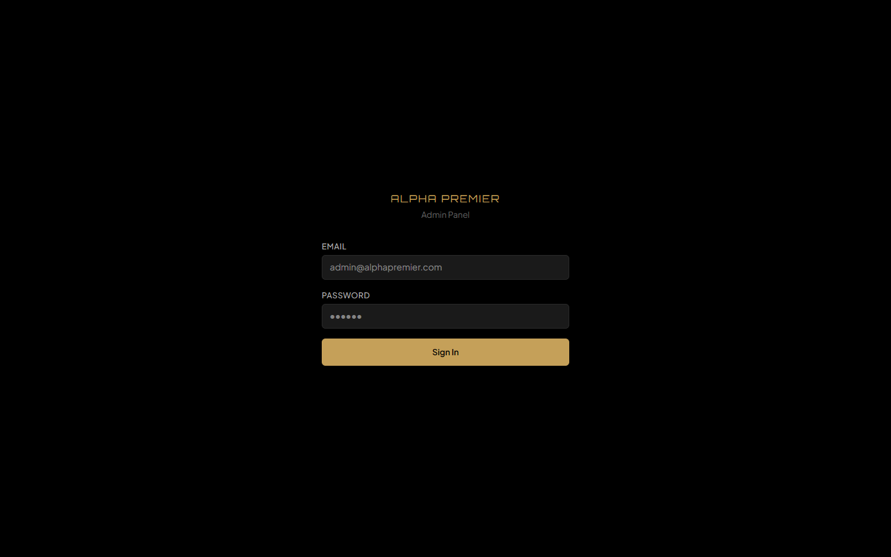

<p align="center">
  
</p>

<h1 align="center">Alpha Premier Group</h1>

<p align="center">
  <strong>The Enterprise Conglomerate Web Portal & Digital Ecosystem.</strong><br/>
  A high-performance Single Page Application across 7 diversified subsidiaries in real estate, construction, logistics, and venture incubation.<br/>
  Modern Vite 7 + React 18 frontend with Native PHP 8+ PDO backend on Hostinger Web Hosting.
</p>

<p align="center">
  <a href="https://github.com/Deign86/apg-website/releases">
    
  </a>
  <a href="https://react.dev">
    
  </a>
  <a href="https://vitejs.dev">
    
  </a>
  <a href="https://tailwindcss.com">
    
  </a>
  <a href="https://www.php.net">
    
  </a>
  <a href="https://www.mysql.com">
    
  </a>
  <a href="LICENSE">
    
  </a>
</p>

<p align="center">
  <a href="#what-is-alpha-premier-group">About</a> •
  <a href="#subsidiaries">Subsidiaries</a> •
  <a href="#features">Features</a> •
  <a href="#architecture">Architecture</a> •
  <a href="#api-reference">API</a> •
  <a href="#tech-stack">Tech Stack</a> •
  <a href="#getting-started">Getting Started</a> •
  <a href="#production-deployment">Deployment</a>
</p>

<br/>

<p align="center">
  
</p>

<p align="center">
  <em>Enterprise conglomerate portal featuring interactive 3D luxury aesthetic, dynamic subsidiary showcases, and instant visitor triage.</em>
</p>

<br/>

<p align="center">
  
</p>

<p align="center">
  <em>Consolidated multi-enterprise grid connecting 7 autonomous Philippine business operations under a unified identity.</em>
</p>

<br/>

<p align="center">
  
</p>

<p align="center">
  <em>Commercial real estate brokerage showcase with property inventory filters, virtual tours, and direct lead acquisition.</em>
</p>

<br/>

<p align="center">
  
</p>

<p align="center">
  <em>Secure administrative command shell for talent ATS pipeline, live concierge, listing management, and site settings.</em>
</p>

<br/>

---

## What is Alpha Premier Group?

**Alpha Premier Group (APG)** is the official web portal for **Alpha Premier Group of Companies OPC**, a diversified Philippine conglomerate. The platform unifies seven autonomous business units—ranging from commercial real estate and civil construction to customs freight forwarding and venture incubation—into a single, high-performance web experience.

Rather than maintaining fragmented, disconnected microsites, APG provides a cohesive luxury brand presence backed by a unified administrative engine and direct SMTP dispatch.

- **Consolidated conglomerate hub** — 7 subsidiary showcases under one domain with custom design systems
- **Blazing-fast client navigation** — Vite 7 + React 18 Single Page Application with React Router 7
- **Zero-framework backend** — Native PHP 8.2+ REST API with strict PDO prepared statements
- **Live concierge & chat triage** — Two-way visitor messaging with automated FAQ matching and human handoff
- **Candidate ATS pipeline** — Career vacancies, authenticated resume file streaming, and status tracking
- **Property listing engine** — Multi-category commercial real estate listings with search and filter controls
- **Enterprise email dispatcher** — Direct socket-level TLS/SSL SMTP mailer connecting directly to Titan Email
- **Turnkey hosting compatibility** — Built for Apache `.htaccess` SPA routing on Hostinger Web Hosting
- **Legacy preservation** — Preserved legacy assets and archives accessible at `/legacy`

---

## Subsidiaries

The platform houses interactive showcases and dedicated portals for all 7 subsidiary enterprises:

| Subsidiary | Route | Industry | Core Capabilities |
|---|---|---|---|
| **Alpha Premier Realty** | `/subsidiaries/realty` | Real Estate Brokerage | Commercial sales, leasing, property acquisition, asset portfolios |
| **Alpha Premier Construction** | `/subsidiaries/construction` | General Contracting | Civil engineering, commercial fit-outs, interior design, renovations |
| **Swift Clear** | `/subsidiaries/swiftclear` | Logistics & Customs | Customs brokerage, international freight forwarding, cargo clearing |
| **Dynamic Tree** | `/subsidiaries/dynamic-tree` | Business Incubation | Corporate advisory, digital transformation, creative consulting |
| **Luxe Prime** | `/subsidiaries/luxe-prime` | Luxury Property | High-end estates, executive penthouses, VIP concierge investments |
| **Alta Venture** | `/subsidiaries/alta-venture` | Private Equity & Capital | Venture incubation, startup capital, financial engineering, M&A |
| **88 Prime** | `/subsidiaries/88prime` | Supply Chain & Trade | Warehousing, commercial distribution, fleet delivery, logistics |

---

## Features

### Consolidated Conglomerate Portal

- **3D Interactive Visuals** — GLTF/GLB 3D globe rendering via Three.js with hardware-accelerated animations
- **Gold Luxury Theme** — Custom Tailwind v4 styling with luxury gradients, animated borders, and dark glassmorphism
- **Responsive Navigation** — Dynamic desktop and mobile navigation headers with instant subsidiary routing

### Live Concierge & Chat Triage

- **Two-Way Realtime Triage** — Public visitor chat widget with automated FAQ intent recognition
- **Live Agent Claiming** — Administrative dashboard allowing agents to claim sessions, reply, and resolve inquiries
- **SMTP Escalation Notification** — Automatically alerts on-duty staff when a visitor requests a human concierge

### Talent Applicant Tracking System (ATS)

- **Job Vacancy Board** — Public career postings categorized by subsidiary, department, and work setup
- **Secure Resume Streaming** — Multipart file upload with strict MIME validation and protected storage
- **Administrative Pipeline** — Review candidates, advance application stages, and record internal recruiter notes

### Commercial Real Estate & Inventory Engine

- **Property Catalog** — Commercial offices, condominiums, warehouses, and industrial spaces
- **Interactive Filtering** — Filter by subsidiary, transaction type (lease/sale), price range, and city
- **Admin CRUD & Image Uploader** — Complete listing lifecycle management with multi-image gallery support

### Direct SMTP Socket Dispatcher

- **Zero Heavy Dependencies** — Lightweight, native socket-level SMTP client (`api/lib/Mailer.php`)
- **Direct SSL/TLS Handshake** — Connects directly to Titan Email / Hostinger mail servers on port 465
- **Dual Notification Routing** — Inquiries generate an instant confirmation to the lead and a branded alert to the executive inbox

---

## Architecture

```
                  ┌────────────────────────────────────────────────────────┐
                  │                 Vite 7 + React 18 SPA                  │
                  │   Tailwind CSS v4 • React Router 7 • Framer Motion     │
                  └──────────────┬─────────────────────────┬───────────────┘
                                 │                         │
                     Public Client / Admin UI          REST API Calls
                                 │                         │
                                 ▼                         ▼
                  ┌────────────────────────────┐ ┌─────────────────────────┐
                  │       Apache Web Server    │ │    Native PHP 8+ API    │
                  │    (.htaccess SPA Rewrite) │ │ (PDO Prepared / REST)   │
                  └──────────────┬─────────────┘ └─────────┬───────────────┘
                                 │                         │
                     ┌───────────┴───────────┐             ▼
                     │                       │   ┌─────────────────────────┐
                     ▼                       ▼   │    MySQL Relational DB  │
             ┌───────────────┐       ┌───────────┤   (Schema & Migrations) │
             │  Dist Assets  │       │  /legacy  │   └─────────────────────────┘
             │  (Production) │       │ (Archive) │             │
             └───────────────┘       └───────────┘             ▼
                                                 ┌─────────────────────────┐
                                                 │   Titan Email / SMTP    │
                                                 │   (Inquiry Dispatch)    │
                                                 └─────────────────────────┘
```

---

## API Reference

The backend exposes a JSON REST API under `/api/` with unified CORS handling, status codes, and input sanitization.

### Public Endpoints

```bash
# Ingest visitor message or trigger FAQ intent
curl -X POST http://localhost:8000/api/chat/message.php \
  -H "Content-Type: application/json" \
  -d '{"session_id": "sess_123", "message": "What commercial offices are available in Ortigas?"}'

# Submit enterprise lead inquiry
curl -X POST http://localhost:8000/api/inquire.php \
  -H "Content-Type: application/json" \
  -d '{"name": "Jane Doe", "email": "jane@example.com", "subsidiary": "realty", "message": "Inquiring for 500sqm office space."}'

# Retrieve active property listings
curl "http://localhost:8000/api/listings.php?subsidiary=realty&type=commercial"

# Fetch published blog articles
curl "http://localhost:8000/api/blogs.php?limit=6"
```

### Admin Endpoints (`/api/admin/`)

Admin endpoints require authenticated session cookies (`$_SESSION['admin_logged_in']`):

```bash
# Admin login
curl -X POST http://localhost:8000/api/admin/auth.php?action=login \
  -H "Content-Type: application/json" \
  -d '{"username": "admin@alphapremiergroup.com", "password": "AlphaPremier2026!"}'

# Live chat queue and message claiming
curl http://localhost:8000/api/admin/chat.php?action=list_active

# Candidate ATS management
curl http://localhost:8000/api/admin/applicants.php
```

---

## Tech Stack

| Layer | Technology | Purpose |
|---|---|---|
| **Frontend Framework** | React 18 | Declarative component UI and virtual DOM |
| **Build Tooling** | Vite 7 | Lightning-fast HMR and optimized production bundling |
| **Routing** | React Router 7 | Client-side routing across portal and 7 subsidiaries |
| **Styling & Theme** | Tailwind CSS v4 | Utility-first styling, CSS variables, and luxury themes |
| **Animations** | Motion & AOS | Smooth transitions, entrance animations, and micro-interactions |
| **Icons & Charts** | Lucide React & Recharts | Modern UI iconography and data visualization dashboards |
| **Backend Runtime** | Native PHP 8.2+ | Lightweight serverless REST API without framework overhead |
| **Database** | MySQL 8.0+ / MariaDB | Relational schema with strict foreign keys and indexed queries |
| **Database Access** | PDO (Prepared Statements) | SQL-injection immune parameterized transactions |
| **Email Dispatcher** | Custom Socket SMTP | Direct SSL/TLS mail delivery via Titan Email |
| **Web Server** | Apache (`.htaccess`) | Production SPA route rewrites and security header enforcement |
| **Deployment Target**| Hostinger Web Hosting | Shared and cloud hosting compatibility via `public_html` |

---

## Getting Started

### Prerequisites

- **Node.js:** `>= 18.x` (Recommended: `20.x` or `22.x`)
- **PHP:** `>= 8.1` with `pdo`, `pdo_mysql`, `mbstring`, `openssl` enabled
- **MySQL:** Local MySQL server or remote database instance

### Quick Start

```bash
# 1. Clone the repository
git clone https://github.com/Deign86/apg-website.git
cd apg-website

# 2. Install dependencies
npm install

# 3. Configure environment
cp .env.example .env

# 4. Provision database schema & admin account
php api/setup.php

# 5. Start Vite development server
npm run dev
```

Visit `http://localhost:5173` to browse the portal.

To run the PHP API locally in parallel:

```bash
php -S localhost:8000 -t .
```

---

## Repository Structure

```
├── .github/
│   ├── assets/                # README screenshots and branding graphics
│   └── workflows/ci.yml       # GitHub Actions CI pipeline
├── api/                       # Native PHP 8+ REST API
│   ├── admin/                 # Protected administrative endpoints
│   ├── chat/                  # Live chat triage and visitor polling
│   ├── lib/Mailer.php         # Standalone socket-level SMTP mailer
│   ├── config.php             # Environment loader and database constants
│   ├── db.php                 # PDO database connection factory
│   ├── inquire.php            # Customer inquiry submission & mail dispatcher
│   ├── listings.php           # Property catalog API
│   ├── schema.sql             # Relational database schema definition
│   └── setup.php              # Automated schema migrator & seeder
├── public/                    # Static public assets & legacy archive
│   ├── assets/                # Subsidiary media and brand marks
│   ├── legacy/                # Preserved legacy website accessible at /legacy
│   └── .htaccess              # Production Apache rewrite directives
├── src/                       # React frontend source
│   ├── components/            # UI components, headers, footers, chat widget
│   ├── routes/                # Route definitions, admin views, subsidiary sub-apps
│   ├── views/                 # Top-level views (Home, Enterprises, Careers, Blogs)
│   ├── App.jsx                # Application shell and routing configuration
│   └── main.jsx               # Application entry point
├── package.json               # Frontend dependencies & npm scripts
├── tsconfig.json              # TypeScript strict configuration
└── vite.config.js             # Vite configuration with Tailwind CSS v4
```

---

## Production Deployment

### Hostinger Web Hosting (`public_html`)

1. **Build Production Assets:**
   ```bash
   npm run build
   ```
2. **Deploy Frontend:** Upload contents of `dist/` directly into your Hostinger `public_html/` root.
3. **Deploy API:** Upload the `api/` directory into `public_html/api/`.
4. **Deploy Legacy (Optional):** Upload `public/legacy/` to `public_html/legacy/`.
5. **Database Setup:** Run `api/schema.sql` via Hostinger phpMyAdmin or execute `php api/setup.php`.
6. **Configure Secrets:** Set production database and Titan Email credentials in `public_html/.env`.
7. **Verify `.htaccess`:** Confirm that `.htaccess` is present in `public_html/` for SPA route rewrites.

---

## Verification & Quality Gates

Run the verification pipeline to ensure zero errors before deploying:

```bash
# Production build check
npm run build

# Code linting
npm run lint

# Backend PHP syntax checks
php -l api/config.php
php -l api/db.php
php -l api/inquire.php
php -l api/setup.php
```

---

## License & Proprietary Rights

All rights reserved. © 2026 **Alpha Premier Group of Companies OPC**.  
Unpublished proprietary software. Unauthorized copying, distribution, or reproduction is strictly prohibited.

---

<p align="center">
  <a href="https://alphapremiergroup.com">alphapremiergroup.com</a>
</p>
